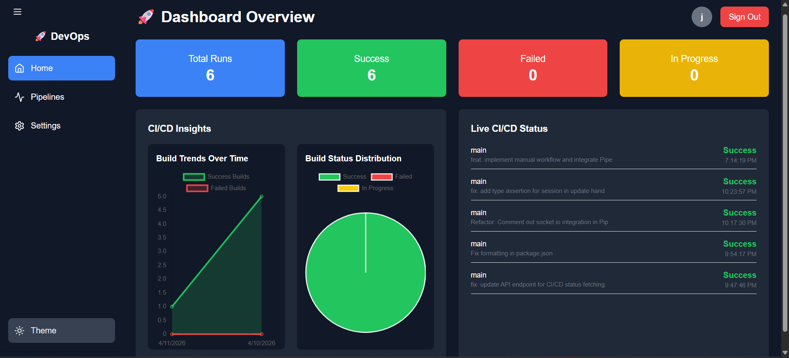

# 🚀 DevOps CI/CD Dashboard  

> A full-stack DevOps dashboard for real-time CI/CD monitoring using GitHub Actions  

---

## 🔥 Currently Building
Improving real-time CI/CD insights and preparing for multi-repository support.

---

## 🌐 Live Demo
👉 https://dev-ops-dashboard-for-ci-cd-monitoring.vercel.app/

---

## 📸 Preview

  

---

## ✨ Features

- 🔐 Secure Authentication (NextAuth.js)
- 📊 Real-time CI/CD pipeline monitoring
- 🔄 Auto-refresh system (polling)
- 📈 Interactive analytics (Line + Pie charts)
- 🧾 Pipeline logs explorer
- 🌙 Dark mode support
- ⚡ Smooth UI animations (Framer Motion)

---

## 🧠 Problem It Solves

Tracking CI/CD pipelines manually on GitHub can be inefficient and fragmented.

This dashboard provides:
- A **centralized view** of pipeline activity  
- **Instant visibility** into failures  
- **Data-driven insights** for build trends  

---

## ⚙️ Tech Stack

### 🚀 Frontend
- Next.js  
- React  
- Tailwind CSS  
- Chart.js  
- Framer Motion  

### 🔧 Backend
- Next.js API Routes  
- MongoDB  
- NextAuth.js  

### 🔗 Integration
- GitHub Actions API  

---

## 🏗️ Architecture

User → NextAuth (Auth) → API Routes → GitHub API → Dashboard UI

---

## ⚡ Key Highlights

- ⚡ Fetches and processes CI/CD data in real-time  
- 📉 Tracks success vs failure trends  
- 🔁 Auto-refresh every few seconds  
- 🎯 Clean, modular, and scalable architecture  

---

## 📂 Project Structure

    /pages
      ├── api/
      │   ├── auth/
      │   │   └── [...nextauth].ts
      │   ├── cicd/
      │   │   └── github.ts
      │   └── user/
      │       └── update.ts
      │
      ├── index.tsx
      ├── signin.tsx
      ├── signup.tsx
      ├── settings.tsx

    /components
      ├── Auth.tsx
      ├── Sidebar.tsx
      ├── CICDChart.tsx
      ├── CICDStatus.tsx
      ├── PipelineLogs.tsx

    /lib
      └── mongodb.ts

---

## 🚀 Getting Started

    git clone https://github.com/jaiteshg/DevOps-Dashboard-for-CI-CD-Monitoring.git
    npm install
    npm run dev

---

## 🔐 Environment Variables

Create `.env.local` file:

    NEXTAUTH_SECRET=your_secret
    NEXTAUTH_URL=http://localhost:3000
    MONGODB_URI=your_mongodb_uri
    GITHUB_TOKEN=your_github_token
    GITHUB_REPO_OWNER=your_username
    GITHUB_REPO_NAME=your_repo

---

## 📈 Future Improvements

- 🔗 Multi-repository support  
- ⚡ WebSocket-based real-time updates  
- 🔔 Notifications for failed builds  
- 📊 Advanced analytics dashboard  

---

## 🤝 Contributing

Pull requests are welcome!  
Feel free to fork and improve the project.

---

## ⭐ Show Your Support

If you like this project, give it a ⭐ on GitHub!